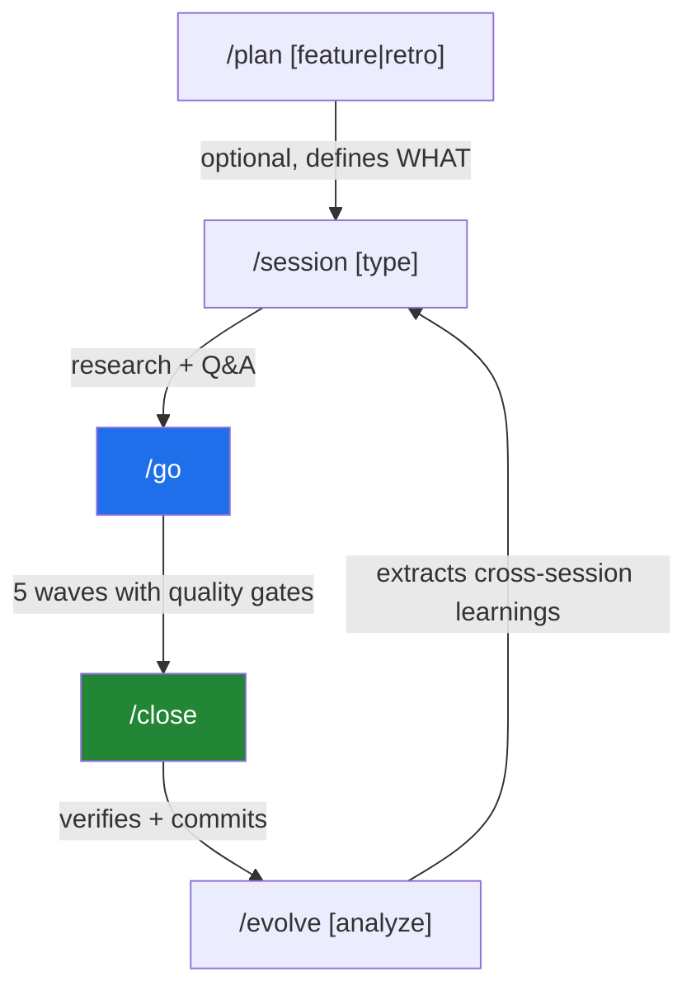
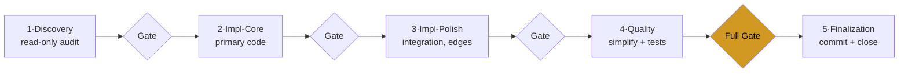
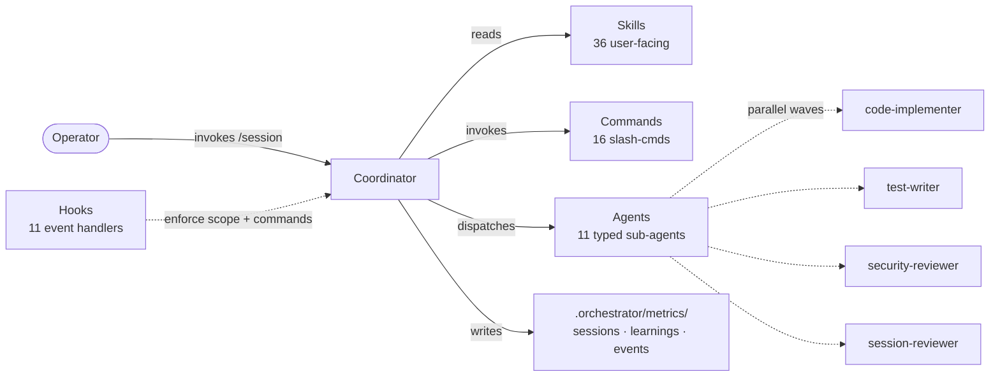

# Session Orchestrator

[](LICENSE)
[](CHANGELOG.md)
[](#development)
[](https://docs.anthropic.com/en/docs/claude-code)
[](https://developers.openai.com/codex/)
[](https://cursor.com)

Turn ad-hoc Claude Code sessions into a repeatable loop with verification gates. Session Orchestrator adds a structured `research → plan → execute in waves → close` cycle on top of your existing agent — across Claude Code, Codex CLI, and Cursor IDE. Inter-wave reviews catch regressions before they ship; carryover issues mean nothing slips through.

## What you get

- **36 skills** for the session lifecycle (start, plan, execute, close, evolve), discovery, vault sync, MCP authoring, debugging, brainstorming, and more
- **16 slash commands** (`/session`, `/go`, `/close`, `/discovery`, `/plan`, `/evolve`, `/autopilot`, `/test`, …)
- **11 typed sub-agents** (code-implementer, test-writer, security-reviewer, session-reviewer, qa-strategist, architect-reviewer, …)
- **11 hook event handlers** enforcing scope, blocking destructive commands, capturing telemetry
- **5632 vitest tests** passing on every commit, validate-plugin 87/87, typecheck 73/73, lint 0

## Lifecycle at a glance



`/plan` is optional. You can create issues manually and jump straight to `/session`. `/evolve` runs deliberately after 5+ sessions, not automatically.

## Quick Start

Add a `## Session Config` section to your project's `CLAUDE.md` (or `AGENTS.md` on Codex CLI), then run three commands:

```text
/session feature
/go
/close
```

The smallest valid Session Config is seven fields:

```yaml
## Session Config

test-command: npm test
typecheck-command: npm run typecheck
lint-command: npm run lint
agents-per-wave: 6
waves: 5
persistence: true
enforcement: warn
```

Everything else is opt-in. See [`docs/session-config-template.md`](docs/session-config-template.md) for the full template and [`docs/session-config-reference.md`](docs/session-config-reference.md) for the canonical type and default reference.

## Install

> **Prerequisite:** Node.js 20 or later. Check with `node --version`. v3.x runs as ES modules and requires a real Node runtime, no Bash shim. [Install Node.js](https://nodejs.org/).

### Claude Code

Run these two slash commands **inside** Claude Code (they are not shell commands):

```text
/plugin marketplace add Kanevry/session-orchestrator
/plugin install session-orchestrator@kanevry
```

Then install Node dependencies **once** (hooks import `zx`):

```bash
cd "$(claude plugin dir session-orchestrator 2>/dev/null || echo ~/.claude/plugins/session-orchestrator)"
npm install
```

Restart Claude Code so the slash commands become available.

### Codex CLI

```bash
git clone https://github.com/Kanevry/session-orchestrator.git ~/Projects/session-orchestrator
cd ~/Projects/session-orchestrator
npm install
node scripts/codex-install.mjs
```

### Cursor IDE

```bash
git clone https://github.com/Kanevry/session-orchestrator.git ~/Projects/session-orchestrator
cd ~/Projects/session-orchestrator
npm install
node scripts/cursor-install.mjs /path/to/your/project
# Session Config goes in CLAUDE.md (Cursor reads CLAUDE.md natively)
```

Setup guides: [Codex](docs/codex-setup.md) and [Cursor IDE](docs/cursor-setup.md). Per-IDE setup notes for `CLAUDE.md` vs `AGENTS.md`: [skills/_shared/instruction-file-resolution.md](skills/_shared/instruction-file-resolution.md).

## How it works

Most agentic-coding tools jump straight into writing code. Session Orchestrator adds a structured loop on top: research first, agree on scope, then execute in five typed waves with verification gates between them.



Here is what happens when you type `/session feature`:

1. **Phase analysis runs in parallel.** Git state, open issues, recent commits, SSOT freshness, plugin freshness, resource health, prior-session memory, and project-intelligence learnings all get inspected. The result is a structured Session Overview with a recommendation, not a wall of raw data.
2. **You agree on scope.** Through a tool-rendered picker (Claude Code) or a numbered list (Codex CLI / Cursor), you pick which issues to tackle. The orchestrator has an opinion and tells you what it would do.
3. **The plan is decomposed into five waves.** Discovery (read-only), Impl-Core, Impl-Polish, Quality, and Finalize. Agent counts per role scale by session type. Each wave has a defined purpose and a deliverable.
4. **`/go` executes.** Agents work in parallel within a wave. A session-reviewer audits the output between waves on eight dimensions: implementation correctness, test coverage, TypeScript health, OWASP, issue tracking, silent failures, test depth, type design. Only findings with confidence at or above 80 reach you.
5. **`/close` ships it.** Every planned item is verified. Quality gates run full. Unfinished work becomes carryover issues so nothing falls through the cracks. Files are staged individually, not via `git add .`, so parallel sessions cannot stomp each other.

Two complementary commands round out the loop:

- **`/plan`** runs *before* a session, when you need a PRD, requirements, or a retrospective.
- **`/evolve`** runs occasionally, deliberately. It analyses session history across runs, surfaces patterns that only emerge over time, and feeds them back as Project Intelligence at the next session-start.

The system is markdown-driven config plus a thin Node runtime. Skills, commands, and agents are Markdown with YAML frontmatter; the runtime under `scripts/lib/*.mjs` and `hooks/*.mjs` handles dispatch, hooks, validation, and telemetry. Everything is plain text — if something goes wrong, you can read every file and see what happened.

## Why this design

**Five typed waves, not one big batch.** Discovery first, so the implementer agents start with shared context. Impl-Core before Impl-Polish, so the architectural decisions land before the integrations. Quality runs a *simplification pass* on AI-generated code before tests are written, otherwise tests pin the AI patterns into place.

**Inter-wave reviews, not just end-of-session.** A session-reviewer agent runs between every wave with explicit confidence scoring on eight dimensions. Only findings at or above confidence 80 surface — this filters speculative criticism and keeps your attention on what matters.

**State persists across crashes.** `STATE.md` records wave progress, mission status, and deviations. If the session is interrupted, the next `/session` invocation offers to resume from the last completed wave. Coordinator snapshots (git refs under `refs/so-snapshots/*`) capture the working tree on demand.

**Hooks enforce, not just warn.** Pre-Bash destructive-command guard blocks `git reset --hard`, `rm -rf`, force-pushes, and ten more rules from `.orchestrator/policy/blocked-commands.json`. Pre-Edit scope enforcement blocks writes outside an agent's `allowedPaths`. The guard runs in main sessions and subagent waves equally.

**Cross-session learning is opt-in and inspectable.** Every session writes a record to `.orchestrator/metrics/sessions.jsonl`. After 5+ sessions, `/evolve analyze` extracts confidence-scored patterns into `learnings.jsonl`. You can read every line, prune via `/evolve review`. Nothing is hidden.

**VCS dual support, no lock-in.** Auto-detects GitLab or GitHub from your git remote. Full lifecycle for both: issue management, MR/PR tracking, pipeline status, label taxonomy, milestone queries.

## What's new since v3.5.0

Five deep sessions plus three intermediate fix-clusters. The v3.6.0 tag (2026-05-14) covers the first three bullets; the Clawpatch cluster and 2.1.x adoption shipped to `main` afterwards and will be in the next tag. Headlines:

- **`/test`** — agentic end-to-end test orchestrator with a 4-check UX rubric, two drivers (Playwright + Peekaboo), a `ux-evaluator` reviewer agent, and issue-tracker reconciliation. Wraps upstream tools (no forks); hard-gates Playwright MCP for browser drive (4× token cost vs CLI per Microsoft's own benchmark).
- **Multi-Story Autopilot** — `scripts/autopilot-multi.mjs` runs N parallel issue pipelines in isolated git worktrees with per-loop kill-switches. Built on the ADR-364 substrate.
- **Clawpatch Borrow Cluster** — six infrastructure capabilities shipped opportunistically: worker pool, language mappers (TypeScript + Markdown AST), schema-per-agent output contracts, sandbox-tier validation, discovery triage state, and `--since` flag for scoped discovery.
- **Claude Code 2.1.x adoption** — `experimental.monitors`, `terminalSequence` (OSC 9 + OSC 777 cross-platform notifications), `disable-model-invocation` on USER-ONLY commands, `model:` frontmatter routing, `Skill(name:*)` permission wildcards.
- **CI restoration** — fixed the 8-pipeline silent regression (lockfile conflict + `engine-strict=true` + `fetch-depth` for gitleaks).

For the full version history see [CHANGELOG.md](CHANGELOG.md). For previous releases: v3.5.0 (2026-05-09), v3.4.0 (2026-05-08), v3.3.0 (2026-04-30).

### Claude Code 2.1.x adoption matrix (condensed)

| Area | Features adopted | Issue |
|---|---|---|
| Hooks & telemetry | `experimental.monitors` plugin manifest; `hookSpecificOutput.additionalContext` on 3 PostToolUse hooks; `terminalSequence` (OSC 9 + OSC 777); `worktree.bgIsolation: "none"` | #427, #428, #429, #431 |
| Commands & skills | `disable-model-invocation: true` on 12 USER-ONLY commands; skill descriptions ≤ 1024 chars + trigger phrases verified across 36/36 | #430, #432 |
| Routing | `model:` frontmatter routing on 36 SKILL.md (opus / sonnet / haiku / inherit); `Skill(name:*)` permission wildcards on 5 worker agents | #434, #435 |
| Validation | `$schema` validation (schemastore.org) on both manifests + CI gate | #433 |

Full table and follow-ups in `CLAUDE.md` (or `AGENTS.md` on Codex CLI) and CHANGELOG.md.

## Repository anatomy



## Components

**Skills (36 user-facing).** Lifecycle: `session-start`, `session-plan`, `wave-executor`, `session-end`, `quality-gates`, `using-orchestrator`. Authoring: `skill-creator`, `mcp-builder`, `hook-development`, `frontmatter-guard`. Planning & discovery: `plan`, `discovery`, `repo-audit`, `brainstorm`, `write-executable-plan`, `debug`, `claude-md-drift-check`. Architecture: `architecture`, `domain-model`, `ubiquitous-language`. Cross-session: `evolve`, `convergence-monitoring`, `memory-cleanup`. Vault & docs: `vault-sync`, `vault-mirror`, `daily`, `docs-orchestrator`. Ecosystem: `bootstrap`, `gitlab-ops`, `gitlab-portfolio`, `ecosystem-health`, `mode-selector`, `autopilot`. Testing: `test-runner`, `playwright-driver`, `peekaboo-driver`.

**Commands (16).** `/session`, `/go`, `/close`, `/discovery`, `/plan`, `/evolve`, `/bootstrap`, `/harness-audit`, `/autopilot`, `/autopilot-multi`, `/repo-audit`, `/test`, `/memory-cleanup`, `/portfolio`, `/brainstorm`, `/debug`.

**Agents (11).** `code-implementer`, `test-writer`, `ui-developer`, `db-specialist`, `security-reviewer`, `session-reviewer`, `docs-writer`, `architect-reviewer`, `qa-strategist`, `analyst`, `ux-evaluator`.

**Hook event matchers / handlers (11 / 11).** `SessionStart` (banner + init), `PreToolUse/Edit|Write` (scope enforcement), `PreToolUse/Bash` (destructive-command guard + enforce-commands), `PostToolUse` (edit validation), `Stop` (session events), `SubagentStop` (telemetry), `PostToolUseFailure` (corrective context), `PostToolBatch` (wave signal + operator-steer), `SubagentStart` (telemetry), `CwdChanged` (cwd-change record). Plus the Clank Event Bus integration in `hooks/_lib/events.mjs`.

**Output Styles.** 3 (`session-report`, `wave-summary`, `finding-report`) for consistent reporting.

**Policy & rules.** `.orchestrator/policy/blocked-commands.json` (13 destructive-command rules); `.claude/rules/parallel-sessions.md` (PSA-001..PSA-004).

**Codex.** `.codex-plugin/plugin.json` (manifest), compatibility config, 3 agent role definitions, marketplace `composerIcon`.

**Scripts.** Deterministic CLI tools (parse-config, run-quality-gate, validate-wave-scope, validate-plugin, token-audit, autopilot, autopilot-multi) plus shared lib (`scripts/lib/*.mjs`) plus a vitest suite of 5632 tests.

## Comparison

| Capability | Session Orchestrator | Manual `CLAUDE.md` | Other orchestrators |
|---|---|---|---|
| Session lifecycle (start → plan → execute → close) | Full, automated | Manual | Partial |
| Typed waves with quality gates | 5 roles, progressive verification | None | Batch execution |
| Session persistence and crash recovery | `STATE.md` plus memory files | None | Partial |
| Scope and command enforcement hooks | PreToolUse with strict / warn / off | None | None |
| Circuit breaker and spiral detection | Per-agent, with recovery | None | Partial |
| Cross-session learning | Confidence-scored learnings | None | None |
| Adaptive wave sizing | Complexity-scored, dynamic | Fixed | Fixed |
| VCS integration (GitLab + GitHub) | Dual, auto-detected | Manual CLI | Usually GitHub only |
| Design-code alignment | Pencil integration | None | None |
| Session close with carryover | Verified, with issue creation | Manual | Partial |

The design goal is engineering quality. Every wave exits verified, every unfinished issue gets a carryover ticket, every session closes with a clean commit.

### vs. maestro-orchestrate

Both [`maestro-orchestrate`](https://github.com/josstei/maestro-orchestrate) and session-orchestrator coordinate multi-agent work in long-running AI coding sessions. They differ in scope and execution model:

| Axis | session-orchestrator | maestro-orchestrate |
|---|---|---|
| Execution model | 5 typed waves (Discovery → Impl-Core → Impl-Polish → Quality → Finalization) with inter-wave quality gates and confidence-scored session-reviewer | 4-phase sequential model with parallel subagents |
| Runtime coverage | Claude Code + Codex CLI + Cursor IDE (3) | Gemini CLI + Claude Code + Codex + Qwen Code (4) |
| VCS integration | GitLab-first with GitHub mirror (auto-detected); 11 hook handlers + 16 commands wire to both | Runtime-agnostic; VCS work delegated to user |
| Cross-session learning | Confidence-scored entries in `.orchestrator/metrics/learnings.jsonl`; surfaced at session-start; opt-in `/evolve` review | Session archival to `docs/maestro/` without explicit learning extraction |
| Specialist agents | 11 typed agents (code-implementer, security-reviewer, test-writer, qa-strategist, etc.) | 39 specialist agents across design/impl/review/debugging/security/compliance |

We see the two plugins as complementary rather than competing: session-orchestrator focuses on a single wave-based lifecycle with VCS+learning integration, while maestro-orchestrate optimises for multi-runtime parallel specialist delivery.

## Platform Support

| Feature | Claude Code | Codex CLI | Cursor IDE |
|---------|------------|-----------|------------|
| OS | macOS, Linux, **Windows (native)** | macOS, Linux, **Windows (native)** | macOS, Linux, **Windows (native)** |
| All 16 commands | Native slash commands | Native plugin commands | Rules-based (.mdc) |
| Parallel agents | Agent tool | Multi-agent roles | Sequential only |
| Session persistence | `.claude/STATE.md` | `.codex/STATE.md` | `.cursor/STATE.md` |
| Shared knowledge | `.orchestrator/metrics/` | `.orchestrator/metrics/` | `.orchestrator/metrics/` |
| Scope enforcement | PreToolUse hooks | Hooks (experimental) | `afterFileEdit` (post-hoc) |
| AskUserQuestion | Native tool | Numbered-list fallback | Numbered-list fallback |
| Quality gates | Full | Full | Full |
| Design alignment | Pencil integration | Pencil integration | Pencil integration |

Windows support is **native** since v3.0.0. No WSL, no Git-Bash, no msys. All file paths use `path.join`, all tmp paths use `os.tmpdir()`, CI verifies on `windows-latest` alongside `ubuntu-latest` and `macos-latest`.

All platforms share the same skills, commands, hooks, and scripts. Platform-specific adaptations are handled in `scripts/lib/platform.mjs`.

### Cursor IDE caveats

Cursor has two event-coverage limitations vs. Claude Code and Codex CLI:

1. **No SessionStart equivalent.** Cursor lacks a conversation-start lifecycle event. Session initialisation must be triggered manually via `/session`.
2. **Post-hoc scope enforcement.** The Cursor-equivalent `afterFileEdit` hook fires *after* the edit. The destructive-command guard (`beforeShellExecution`) is fully equivalent to Claude Code's PreToolUse Bash gate. Scope enforcement is best-effort warn-only on Cursor.

Active Cursor hooks: 2 events (`afterFileEdit`, `beforeShellExecution`) routed to 2 handlers (`enforce-scope.mjs`, `enforce-commands.mjs`).

### Cross-platform notifications

Session-stop emits an OSC desktop notification via the `terminalSequence` hook output field (CC 2.1.141+). Coverage: iTerm2, Windows Terminal, WezTerm, ConEmu (OSC 9); Ghostty, urxvt, Warp (OSC 777). Both sequences are emitted together — unsupported terminals silently ignore.

## Destructive-command guard

`hooks/pre-bash-destructive-guard.mjs` blocks destructive shell commands in the main session and in subagent waves. Policy lives in `.orchestrator/policy/blocked-commands.json` (13 rules covering `git reset --hard`, `rm -rf`, `git push --force`, and more).

Bypass per-session by adding to your Session Config:

```yaml
allow-destructive-ops: true
```

Set this for intentional maintenance sessions only. The rule source of truth is [`.claude/rules/parallel-sessions.md`](.claude/rules/parallel-sessions.md) (PSA-003), vendored to all consumer repos via `/bootstrap`.

## Agent authoring

Custom agents live in `agents/` (plugin) or `.claude/agents/` (project) as Markdown with YAML frontmatter. The frontmatter contract follows the canonical [code.claude.com/sub-agents](https://code.claude.com/docs/en/sub-agents) spec. Required fields:

```yaml
---
name: kebab-case-name           # 3-50 chars, lowercase + hyphens only
description: Use this agent when [conditions]. <example>...</example>
model: inherit                  # inherit | sonnet | opus | haiku, OR full ID like claude-opus-4-7
color: blue                     # blue | cyan | green | yellow | purple | orange | pink | red | magenta
tools: Read, Grep, Glob, Bash   # comma-separated string OR JSON array; both accepted
---
```

**Critical:** `description` must be a single-line inline string, not a YAML block scalar (`>` or `|`). Put `<example>` blocks inline. Reference: [Anthropic agent-development SKILL.md](https://github.com/anthropics/claude-code/blob/main/plugins/plugin-dev/skills/agent-development/SKILL.md). Body conventions: 500 to 3000 words, sections in the order Core Responsibilities → Process → Quality Standards → Output Format → Edge Cases.

## Development

Clone, install, verify in three commands:

```bash
git clone https://github.com/Kanevry/session-orchestrator.git && cd session-orchestrator
npm install
npm test        # vitest, 5632 tests
```

Additional scripts:

- `npm run test:watch`: vitest in watch mode
- `npm run lint` / `npm run lint:fix`: ESLint v10 + Prettier
- `npm run typecheck`: `node --check` on every `.mjs` file (syntactic only; no TypeScript yet)
- `npm run format` / `npm run format:check`: Prettier write or check

### Pre-commit hooks (Husky + commitlint + lint-staged)

`.npmrc` ships with `ignore-scripts=true` (SEC-020 supply-chain defence), so the `prepare` script does **not** auto-run on `npm install`. After cloning, run husky once manually:

```bash
npm install
npx husky                  # one-time setup, wires git hooks via .husky/_/
```

After that, `git commit` will:

- **pre-commit**: run `lint-staged` (ESLint `--fix` on staged `*.mjs` files) and a gitleaks scan on staged files.
- **commit-msg**: validate Conventional Commits format via commitlint.

To bypass (rare, emergencies only): `git commit --no-verify`. CI re-runs everything pre-commit ran, plus more.

For contributor-facing architecture, hook authoring, and the `zx`-vs-stdlib heuristic, see [docs/plugin-architecture-v3.md](docs/plugin-architecture-v3.md).

## Documentation

- [User Guide](docs/USER-GUIDE.md): installation, config reference, workflow walkthrough, FAQ
- [Migration to v3](docs/migration-v3.md): upgrade path from v2.x to v3.0.0, known issues, rollback
- [Plugin Architecture (v3)](docs/plugin-architecture-v3.md): contributor guide, layering, hook anatomy, lib catalog, testing
- [CONTRIBUTING.md](CONTRIBUTING.md): plugin architecture, skill anatomy, development setup
- [CHANGELOG.md](CHANGELOG.md): version history
- [Example Configs](docs/examples/): Session Config examples for Next.js, Express, Swift

## Community

[GitHub Discussions](https://github.com/Kanevry/session-orchestrator/discussions) are open for questions, ideas, and show-and-tell. For bug reports and feature requests, use [Issues](https://github.com/Kanevry/session-orchestrator/issues). We follow [Conventional Commits](https://www.conventionalcommits.org/) — see [CONTRIBUTING.md](CONTRIBUTING.md) for details.

## Links

- [Homepage](https://gotzendorfer.at/en/session-orchestrator)
- [Privacy Policy](https://gotzendorfer.at/en/session-orchestrator/privacy)

## Project state

For the live runtime SSOT, see [`CLAUDE.md`](./CLAUDE.md):

- `## Current State` block (active epic, test count, backlog snapshot, recent sessions)
- `## Session Config` block (read at runtime by `skills/_shared/config-reading.md`)

On Codex CLI the same file is `AGENTS.md`. Resolution rule: [skills/_shared/instruction-file-resolution.md](skills/_shared/instruction-file-resolution.md).

## License

[MIT](LICENSE)
